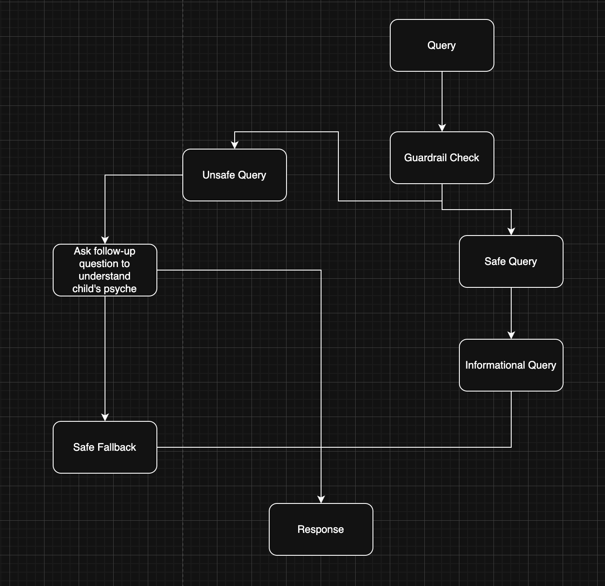
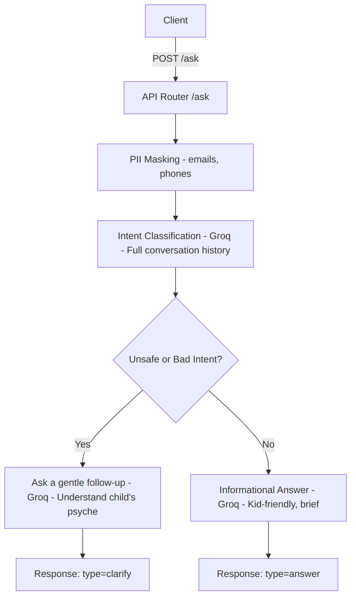

## Sprouts Chat API

Kid-safe, engaging chat for ages 4-8. The service uses Groq for LLM responses with guardrails that classify intent using the full conversation history, ask clarifying questions for unsafe/bad intent, and answer safe informational queries in a brief, child-friendly style.

## High Level Architecure Diagram


## Features
- Intent classification using full chat history (Groq JSON output)
- PII masking (emails/phones) before moderation
- Clarify-first approach for unsafe/bad intent (one gentle, supportive question)
- Kid-friendly answers for safe queries
- FastAPI server with `/ask` and `/health` endpoints

## Requirements
- Python 3.11+
- Groq API key: set `GROQ_API_KEY`

## Quick start (local)
1) Install deps
```bash
pip install -r requirements.txt
```

2) Set your Groq key (zsh example)
```bash
export GROQ_API_KEY="your_groq_api_key_here"
```

3) Run the server (choose one)
```bash
# via uvicorn
uvicorn sprouts.main:app --host 0.0.0.0 --port 8000

# or run the module directly (respects HOST/PORT/RELOAD envs)
python sprouts/main.py
```

## Environment variables
- `GROQ_API_KEY` (required): your Groq API key
- `HOST` (optional, default 0.0.0.0)
- `PORT` (optional, default 8000)
- `RELOAD` (optional, default false)

## API
### Health
- GET `/health`
- Response: `{ "status": "OK" }`

### Ask
- POST `/ask`
- Body
```json
{
  "messages": [
    {"role": "user", "content": "Tell me a fun fact about space."}
  ],
  "model": "openai/gpt-oss-20b",
  "extra_params": null
}
```

- Response (answer)
```json
{
  "type": "answer",
  "message": "A kid-friendly short answer...",
  "suggested_next": "An optional gentle follow-up",
  "safety": {
    "action": "allow",
    "intent": "good",
    "must_block": false,
    "category": "other",
    "severity": 0.0,
    "reasons": ["..."]
  }
}
```

- Response (clarify)
```json
{
  "type": "clarify",
  "message": "A gentle, supportive question asking for intent.",
  "suggested_next": null,
  "safety": {
    "action": "clarify",
    "intent": "bad",
    "must_block": false,
    "category": "weapons",
    "severity": 0.4,
    "reasons": ["..."]
  }
}
```

## curl examples
Health
```bash
curl -s http://localhost:8000/health
```

Simple safe question
```bash
curl -s -X POST http://localhost:8000/ask \
  -H 'Content-Type: application/json' \
  -d '{
    "messages": [
      {"role":"user","content":"Tell me a fun fact about space."}
    ]
  }'
```

Ambiguous (likely clarify)
```bash
curl -s -X POST http://localhost:8000/ask \
  -H 'Content-Type: application/json' \
  -d '{
    "messages": [
      {"role":"user","content":"How can I make a sword at home?"}
    ]
  }'
```

Follow-up after clarify
```bash
curl -s -X POST http://localhost:8000/ask \
  -H 'Content-Type: application/json' \
  -d '{
    "messages": [
      {"role":"user","content":"How can I make a sword at home?"},
      {"role":"assistant","content":"<assistant clarify question here>"},
      {"role":"user","content":"It is for a school play prop. I want it safe."}
    ]
  }'
```

## Architecture (current flow)


## Project structure
```text
sprouts/
  main.py              # FastAPI app and runner
  routes.py            # /ask and /health endpoints
  utils.py             # groq_chat_completion JSON helper
  guardrail/
    moderation.py      # classify_intent using full history
    pii.py             # basic PII masking
  qna/
    answering.py       # kid-friendly answers
    clarifier.py       # one gentle follow-up question
schemas.py             # Pydantic models (AskRequest, AskResponse)
requirements.txt
Dockerfile
.dockerignore
```

## Docker Usage
Build
```bash
docker build -t sprouts-chat:latest .
```

Run
```bash
docker run --rm -p 8000:8000 \
  -e GROQ_API_KEY=$GROQ_API_KEY \
  sprouts-chat:latest
```

## Notes
- All Groq calls return JSON and are non-streaming. If you see JSON validation errors due to length, you can adjust `extra_params` in the specific QnA/guardrail call sites.
- `GROQ_API_KEY` must be set; otherwise the server will raise a clear error.


