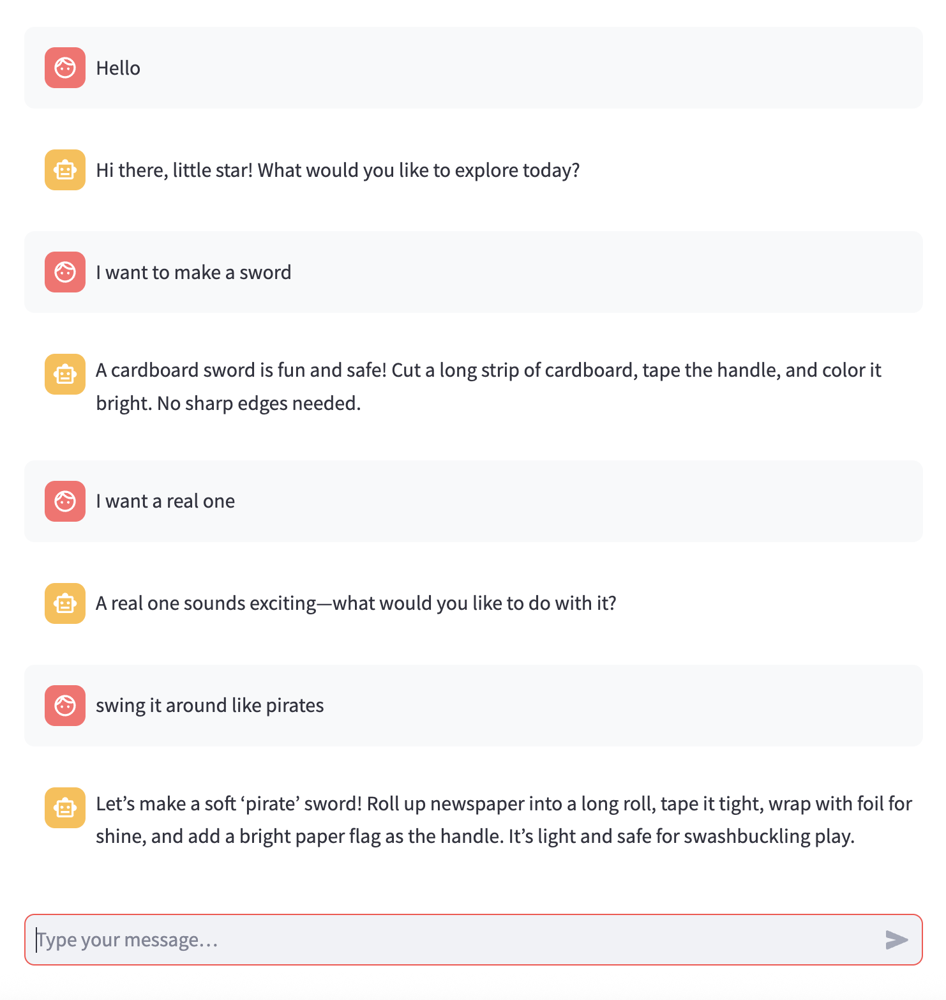

# Sprouts Test UI (Streamlit)

Simple throwaway UI to test the Sprouts Chat API.



## Setup
```bash
cd test-ui
pip install -r requirements.txt
```

## Run
```bash
API_BASE=http://localhost:8000 streamlit run app.py
```

- Use the sidebar Health Check to verify the API is reachable.
- Chat in the box at the bottom; the app sends your conversation history to `/ask`.

## Notes
- The UI stores messages in session state and displays them using Streamlit chat components.
- Set `API_BASE` to your deployed API URL when testing remotely.
